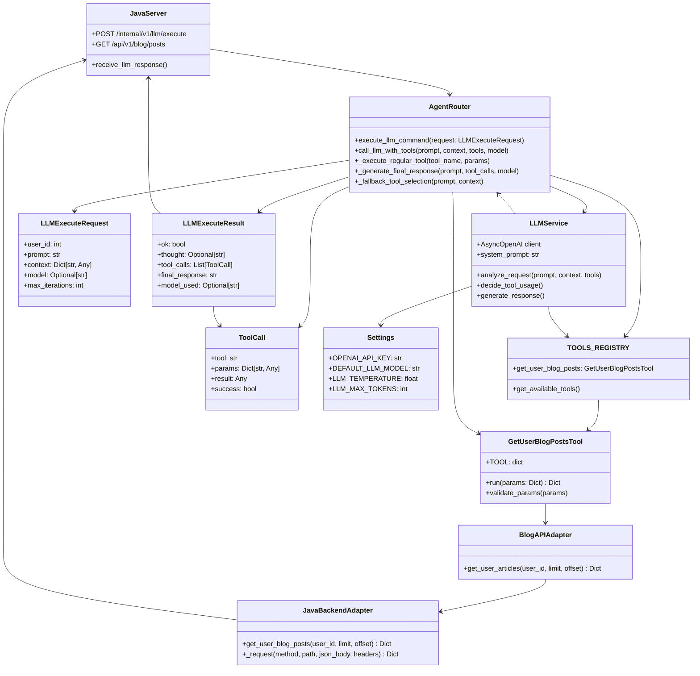
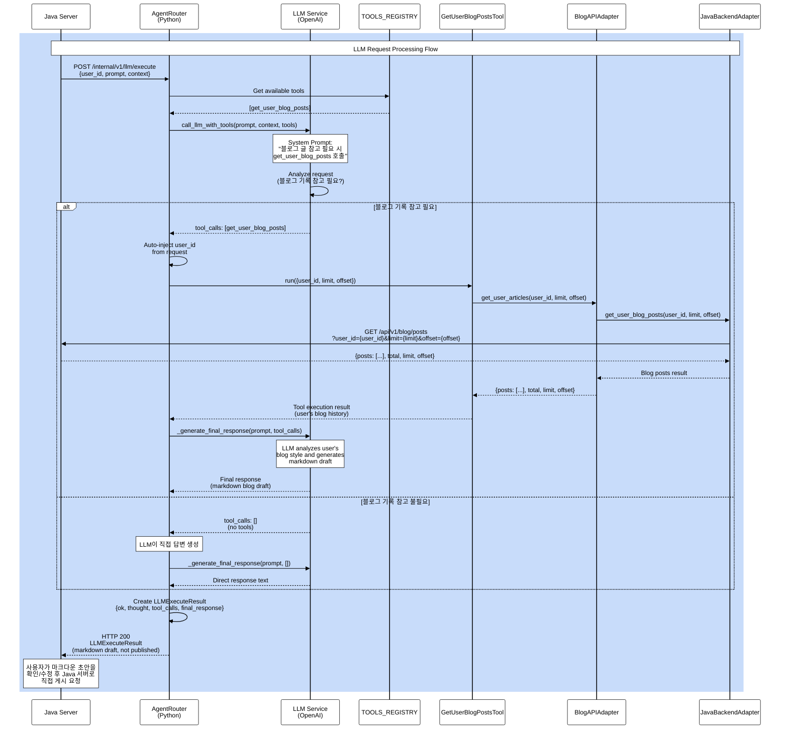
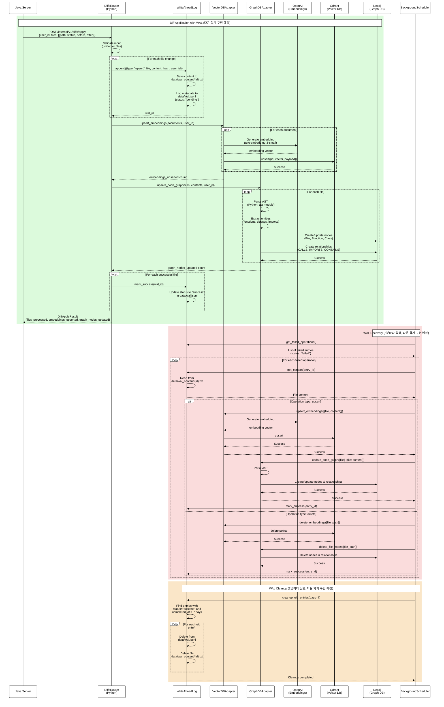
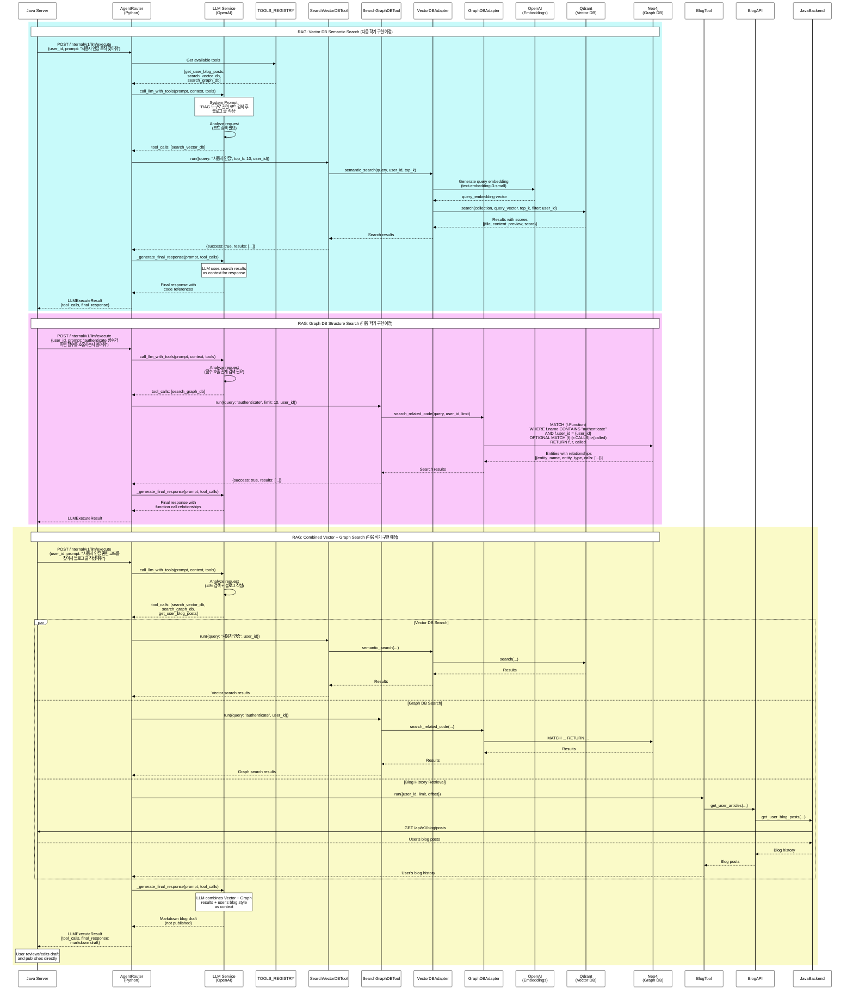

# Clog System Architecture Diagrams

This document contains Mermaid diagrams visualizing the architecture and workflows of the Clog system (TS-LLM-MCP Bridge).

## LLM Agent Flow - Class Diagram

The following class diagram illustrates the LLM agent flow from Java server request to blog draft generation:

## LLM Agent Flow - Sequence Diagram

The following sequence diagram shows the detailed flow of LLM request processing:

### Class Details (구현 기반 상세 설명)

- **JavaServer**  
  - LLM 호출을 트리거하는 상위 시스템입니다. `POST /internal/v1/llm/execute` 요청에 `user_id`, `prompt`, `context`를 담아 Python 서버로 전달하고, 작업 완료 후 `LLMExecuteResult`를 받아 사용자에게 전달합니다.  
  - Python 서버가 블로그 히스토리를 조회할 때에도 Java 서버가 제공하는 `GET /api/v1/blog/posts` 엔드포인트가 사용되므로, 입력-출력 모두에 관여합니다. (`src/server/routers/agent.py`, `src/adapters/java_backend.py`)

- **AgentRouter**  
  - FastAPI 라우터 계층으로, LLM 요청 라이프사이클 전체를 관리합니다.  
  - 주요 책임:  
    1. `TOOLS_REGISTRY`에서 사용 가능한 MCP 툴들을 수집  
    2. `call_llm_with_tools`로 OpenAI API를 호출하여 시스템 프롬프트와 툴 목록을 전달  
    3. LLM이 선택한 툴을 `_execute_regular_tool`로 실행하면서 `user_id` 같은 필수 파라미터를 자동 주입  
    4. 툴 결과를 합쳐 `_generate_final_response`로 최종 마크다운 초안을 생성  
  - 장애 상황에서는 `_fallback_tool_selection`과 `_create_fallback_response`로 안전하게 응답합니다. (`src/server/routers/agent.py`)

- **LLMService**  
  - `call_llm_with_tools`와 `_generate_final_response` 함수로 구현된 가상 서비스 계층입니다.  
  - `AsyncOpenAI` 클라이언트를 생성해 시스템 프롬프트, 사용자 메시지, 툴 스키마를 전달하고, 모델이 반환한 `tool_calls`를 파싱해 에이전트에게 알려줍니다.  
  - 최종 응답 생성 시에는 각 툴 결과를 요약하여 LLM에 다시 전달, 사용자 친화적인 2~3문장 마크다운 답변을 받아 돌려줍니다. (`src/server/routers/agent.py`)

- **TOOLS_REGISTRY**  
  - 에이전트에서 사용할 수 있는 모든 MCP 툴을 중앙에서 관리하는 딕셔너리입니다.  
  - 현재 활성화된 항목은 `get_user_blog_posts` 하나지만, 향후 Vector/Graph DB 툴을 주석 해제하면 즉시 확장할 수 있도록 구조화되어 있습니다.  
  - LLM에 전달할 스키마(`tool.TOOL`) 조회와 실제 실행 모듈(`tool.run`) 참조를 동시에 맡습니다. (`src/server/routers/agent.py`)

- **GetUserBlogPostsTool**  
  - MCP 표준 형식에 맞춘 메타데이터(`name`, `description`, `input_schema`)와 실행 함수(`run`)를 제공합니다.  
  - `user_id` 필수 확인 후 `limit`, `offset` 기본값을 적용하고 `blog_api.get_user_articles`로 실제 데이터를 가져옵니다.  
  - 반환 값은 포스트 리스트와 전체 개수, 페이지 정보가 포함되어 LLM이 스타일/태그 패턴을 분석하는 데 사용됩니다. (`src/mcp/tools/get_user_blog_posts.py`)

- **BlogAPIAdapter**  
  - Python 서버 내부에서 Java 백엔드 호출을 캡슐화하는 얇은 추상화 계층입니다.  
  1. `java_backend.get_user_blog_posts` 호출  
  2. 응답 포스트 수를 로깅해 관측성을 확보  
  3. 실패 시 `httpx.HTTPError`를 그대로 던져 상위 라우터가 적절히 처리할 수 있도록 합니다. (`src/adapters/blog_api.py`)

- **JavaBackendAdapter**  
  - Java 서버와의 모든 HTTP 통신 규칙을 담당합니다.  
  - `_build_url`, `_build_headers`, `_request` 유틸 함수를 통해 베이스 URL/타임아웃/로깅/에러 처리를 표준화하며, `get_user_blog_posts` 같은 도메인 함수는 이를 재사용합니다.  
  - 현재는 같은 EC2 내 통신을 가정하여 JWT 헤더 없이 호출하고, 응답 JSON 디코딩 실패 시 명확한 예외를 던집니다. (`src/adapters/java_backend.py`)

- **LLMExecuteRequest**  
  - Java 서버→Python 서버 호출 시 바디를 검증하는 Pydantic 모델입니다.  
  - 사용자의 자연어 명령(`prompt`) 외에도 자유형 컨텍스트(`context`), 특정 모델 강제(`model`), 무한루프 방지용 반복 제한(`max_iterations`)을 명시적으로 선언합니다. (`src/server/schemas.py`)

- **LLMExecuteResult**  
  - 에이전트 실행 결과를 Java 서버에 전달하는 표준 응답입니다.  
  - `ok` 상태, LLM 사고 과정(`thought`), 각 툴 실행 기록(`tool_calls`), 사용자에게 보여줄 최종 마크다운(`final_response`), 실제 사용 모델(`model_used`)을 포함합니다.  
  - Java 서버는 이 구조를 그대로 프론트엔드/사용자에게 전달하거나 추가 로깅에 활용할 수 있습니다. (`src/server/schemas.py`)

- **ToolCall**  
  - 개별 툴 실행 단위를 표현하는 모델로, 어떤 툴이 어떤 파라미터와 함께 호출됐고 성공했는지 여부, 결과 페이로드를 보존합니다.  
  - AgentRouter의 실행 루프와 `LLMExecuteResult.tool_calls`에 동일한 구조를 사용해 디버깅과 회귀 분석이 용이합니다. (`src/server/schemas.py`)

- **Settings**  
  - `pydantic_settings.BaseSettings`를 상속해 `.env` 기반 환경 설정을 로드합니다.  
  - 서버 바인딩 정보, Java 백엔드 URL/타임아웃, OpenAI API 키와 기본 모델, Vector/Graph DB 설정, 기능 플래그 등을 한 곳에서 관리하며 `settings = Settings()` 싱글턴으로 전역 접근을 제공합니다. (`src/server/settings.py`)

## Component Descriptions

### AgentRouter
- **execute_llm_command**: Main endpoint that receives LLM execution requests from Java server
- **call_llm_with_tools**: Calls OpenAI API with system prompt and available tools
- **_execute_regular_tool**: Executes a tool from the registry
- **_generate_final_response**: Generates user-friendly final response using LLM
- **Auto-inject user_id**: Automatically injects `user_id` from request into `get_user_blog_posts` tool calls

### LLMService
- **System Prompt**: Instructs LLM to analyze requests and call `get_user_blog_posts` when user's blog history should be referenced
- **Tool Selection**: LLM decides whether to use `get_user_blog_posts` tool based on whether blog history reference is needed
- **Response Generation**: Creates final response (markdown blog draft) based on tool execution results and user's blog style

### GetUserBlogPostsTool
- **TOOL**: Tool metadata (name, description, input_schema)
- **run**: Retrieves user's blog post history with user_id, limit, and offset parameters
- Returns blog posts with metadata (title, content, tags, created_at, etc.)

### BlogAPIAdapter
- **get_user_articles**: Retrieves user's blog articles via Java backend
- Handles error cases and logging
- Returns blog posts list with pagination metadata

### JavaBackendAdapter
- **get_user_blog_posts**: Sends HTTP GET request to Java server blog API
- Endpoint: `GET /api/v1/blog/posts?user_id={user_id}&limit={limit}&offset={offset}`
- Internal communication (no JWT required)

## Decision Flow

1. **Java Server** sends LLM request with `user_id`, `prompt`, and `context`
2. **AgentRouter** receives request and gets available tools from registry
3. **LLMService** analyzes the request using system prompt:
   - If user's blog history should be referenced (blog writing request, style matching needed, etc.): Selects `get_user_blog_posts` tool
   - If not needed (simple question unrelated to blog): Responds directly without tools
4. **If tool selected**: 
   - AgentRouter auto-injects `user_id` from request
   - Tool executes → BlogAPIAdapter → JavaBackendAdapter → Java Server (GET request)
   - Returns user's blog post history
5. **Final response**: LLM analyzes user's blog style and generates markdown blog draft (not published)
6. **User action**: User reviews/edits the draft and publishes directly to Java server (Python server not involved in publishing)

---

## Next Semester: Diff Application & WAL Processing - Sequence Diagram

**⚠️ 다음 학기 구현 예정**: 현재 주석 처리된 코드를 기반으로 한 예상 흐름입니다.

### Diff Application & WAL Processing - Component Descriptions

#### DiffsRouter
- **apply_diff**: Receives diff requests from Java server and processes file changes
- **Input validation**: Validates unified diff or files array format
- **WAL logging**: Logs all operations to WAL before execution
- **Error handling**: Marks operations as success/failure in WAL

#### WriteAheadLog (WAL)
- **append**: Logs operation metadata to `data/wal.jsonl` and saves content to `data/wal_content/{id}.txt`
- **mark_success/mark_failure**: Updates operation status in WAL
- **get_failed_operations**: Retrieves failed operations for recovery
- **get_content**: Restores file content from WAL content files
- **cleanup_old_entries**: Removes old successful entries (7+ days)

#### VectorDBAdapter
- **upsert_embeddings**: Generates embeddings using OpenAI and upserts to Qdrant
- **delete_embeddings**: Deletes embeddings from Qdrant
- **semantic_search**: Performs semantic search (used by RAG tools)

#### GraphDBAdapter
- **update_code_graph**: Parses code AST and creates/updates nodes and relationships in Neo4j
- **delete_file_nodes**: Deletes file-related nodes from Neo4j
- **search_related_code**: Searches code entities and relationships (used by RAG tools)

#### BackgroundScheduler
- **wal_recovery_task**: Runs every 5 minutes to retry failed WAL operations
- **wal_cleanup_task**: Runs daily to clean up old WAL entries

---

## Next Semester: RAG (Retrieval-Augmented Generation) - Sequence Diagram

**⚠️ 다음 학기 구현 예정**: 현재 주석 처리된 RAG 툴을 기반으로 한 예상 흐름입니다.

### RAG - Component Descriptions

#### SearchVectorDBTool
- **TOOL**: Tool metadata for semantic search
- **run**: Executes semantic search using embeddings
- **Parameters**: `query` (search text), `top_k` (number of results), `user_id` (auto-injected)

#### SearchGraphDBTool
- **TOOL**: Tool metadata for graph-based code structure search
- **run**: Executes graph search for code entities and relationships
- **Parameters**: `query` (entity name), `limit` (max results), `user_id` (auto-injected)

#### VectorDBAdapter (RAG usage)
- **semantic_search**: Generates query embedding and searches Qdrant for similar code
- **Returns**: File paths, content previews, similarity scores
- **User isolation**: Filters results by `user_id`

#### GraphDBAdapter (RAG usage)
- **search_related_code**: Searches Neo4j for code entities matching query
- **Returns**: Entity information (functions, classes) with call relationships
- **User isolation**: Filters results by `user_id`

### RAG Decision Flow

1. **LLM analyzes request**: Determines if code search is needed
2. **Tool selection**:
   - **search_vector_db**: When semantic similarity search is needed (e.g., "사용자 인증 로직 찾아줘")
   - **search_graph_db**: When code structure/relationships are needed (e.g., "authenticate 함수가 호출하는 함수들")
   - **Both tools**: When comprehensive code context is needed
3. **Search execution**: Tools query Vector DB and/or Graph DB
4. **Context injection**: Search results are passed to LLM as context
5. **Response generation**: LLM generates response using code context
