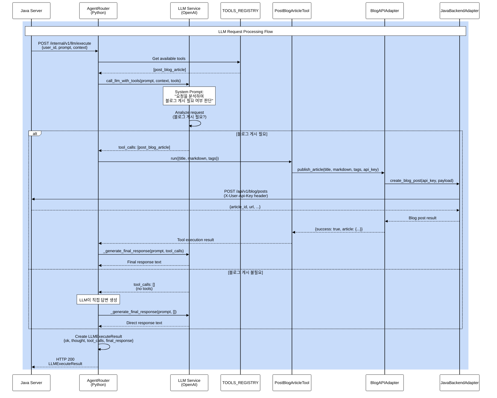
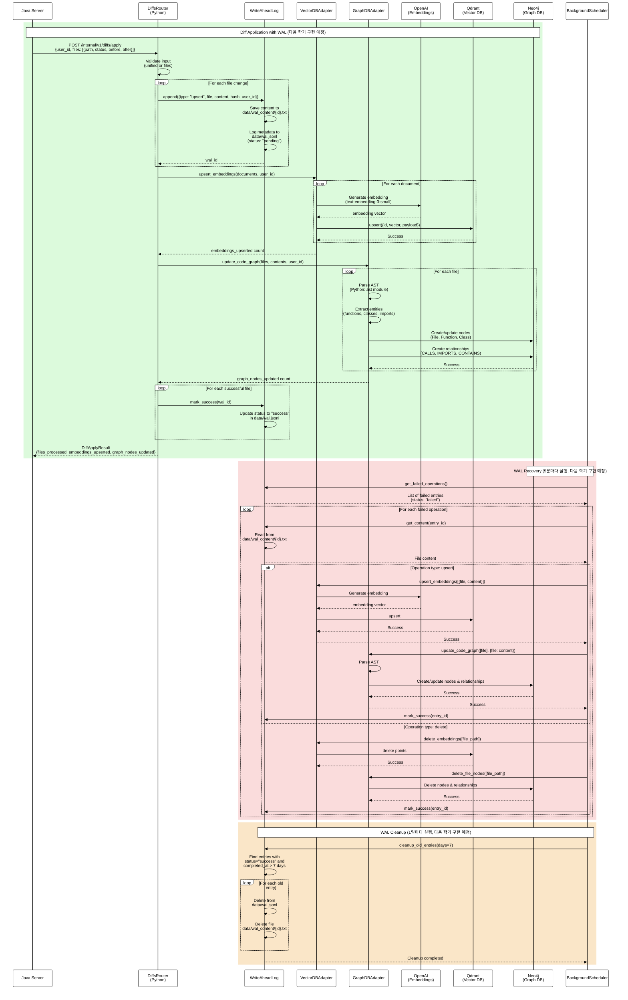
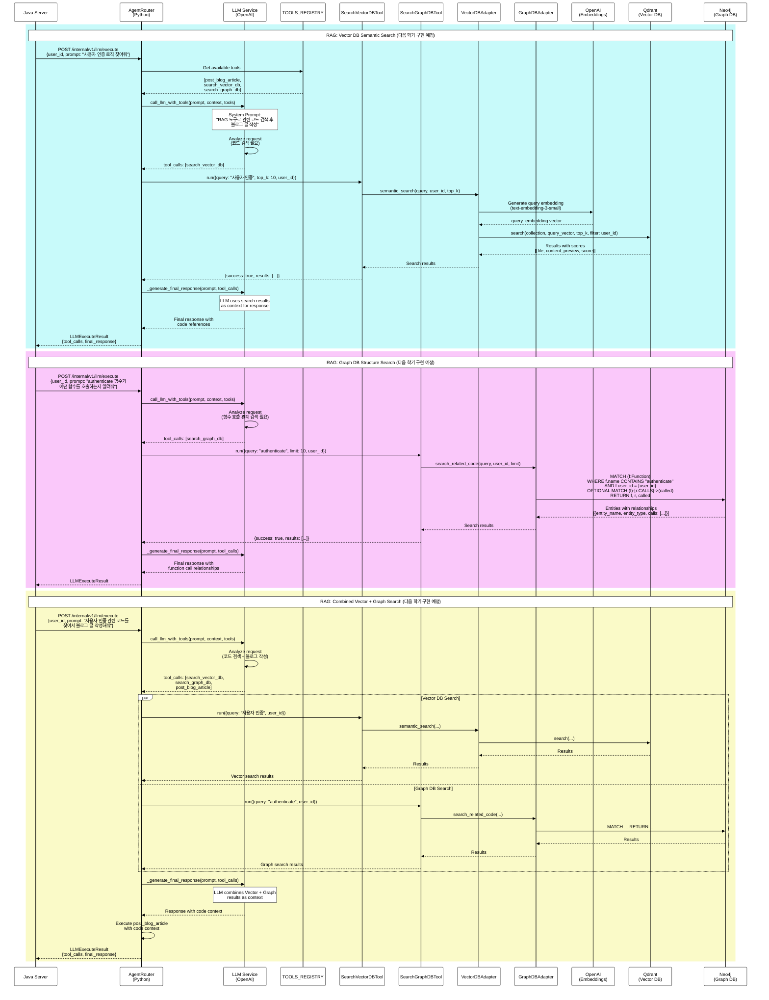

# Clog System Architecture Diagrams

This document contains Mermaid diagrams visualizing the architecture and workflows of the Clog system (TS-LLM-MCP Bridge).

## LLM Agent Flow - Class Diagram

The following class diagram illustrates the LLM agent flow from Java server request to blog publishing:

```mermaid
%%{init: {'theme':'base', 'themeVariables': { 'primaryColor':'#fff', 'primaryTextColor':'#000', 'primaryBorderColor':'#000', 'lineColor':'#000', 'secondaryColor':'#f0f0f0', 'tertiaryColor':'#fff', 'mainBkg':'#e8f4f8', 'secondBkg':'#f0f0f0', 'mainContrastColor':'#000', 'darkMode':'false', 'background':'#ffffff', 'tertiaryBorderColor':'#000', 'tertiaryTextColor':'#000', 'fontSize':'16px', 'nodeBorder':'#2c3e50', 'clusterBkg':'#ecf0f1', 'clusterBorder':'#34495e', 'titleColor':'#000', 'edgeLabelBackground':'#fff', 'classText':'#000'}}}%%
classDiagram
    %% External Systems
    class JavaServer {
        +POST /internal/v1/llm/execute
        +receive_llm_response()
    }

    %% FastAPI Router Layer
    class AgentRouter {
        +execute_llm_command(request: LLMExecuteRequest)
        +call_llm_with_tools(prompt, context, tools, model)
        +_execute_regular_tool(tool_name, params)
        +_generate_final_response(prompt, tool_calls, model)
        +_fallback_tool_selection(prompt, context)
    }

    %% LLM Service
    class LLMService {
        +AsyncOpenAI client
        +system_prompt: str
        +analyze_request(prompt, context, tools)
        +decide_tool_usage()
        +generate_response()
    }

    %% Tool Registry
    class TOOLS_REGISTRY {
        +post_blog_article: PostBlogArticleTool
        +get_available_tools()
    }

    %% MCP Tool
    class PostBlogArticleTool {
        +TOOL: dict
        +run(params: Dict) Dict
        +validate_params(params)
    }

    %% Adapter Layer
    class BlogAPIAdapter {
        +publish_article(title, markdown, tags, api_key) Dict
    }

    class JavaBackendAdapter {
        +create_blog_post(api_key, payload) Dict
        +_request(method, path, json_body, headers) Dict
    }

    %% Data Models
    class LLMExecuteRequest {
        +user_id: int
        +prompt: str
        +context: Dict[str, Any]
        +model: Optional[str]
        +max_iterations: int
    }

    class LLMExecuteResult {
        +ok: bool
        +thought: Optional[str]
        +tool_calls: List[ToolCall]
        +final_response: str
        +model_used: Optional[str]
    }

    class ToolCall {
        +tool: str
        +params: Dict[str, Any]
        +result: Any
        +success: bool
    }

    class Settings {
        +OPENAI_API_KEY: str
        +BLOG_API_KEY: str
        +DEFAULT_LLM_MODEL: str
        +LLM_TEMPERATURE: float
        +LLM_MAX_TOKENS: int
    }

    %% Relationships
    JavaServer --> AgentRouter : POST /internal/v1/llm/execute
    AgentRouter --> LLMExecuteRequest : receives
    AgentRouter --> LLMService : uses
    AgentRouter --> TOOLS_REGISTRY : queries
    AgentRouter --> LLMExecuteResult : returns
    LLMExecuteResult --> JavaServer : HTTP response

    LLMService --> Settings : reads OPENAI_API_KEY
    LLMService --> TOOLS_REGISTRY : gets available tools
    LLMService ..> AgentRouter : returns tool_calls

    TOOLS_REGISTRY --> PostBlogArticleTool : contains
    AgentRouter --> PostBlogArticleTool : executes
    PostBlogArticleTool --> BlogAPIAdapter : calls
    PostBlogArticleTool --> Settings : reads BLOG_API_KEY
    BlogAPIAdapter --> JavaBackendAdapter : uses
    JavaBackendAdapter --> JavaServer : HTTP POST /api/v1/blog/posts

    AgentRouter --> ToolCall : creates
    LLMExecuteResult --> ToolCall : contains

    %% Styling with CSS classes
    classDef javaServer fill:#e74c3c,stroke:#c0392b,stroke-width:3px,color:#fff
    classDef agentRouter fill:#3498db,stroke:#2980b9,stroke-width:3px,color:#fff
    classDef llmService fill:#9b59b6,stroke:#8e44ad,stroke-width:3px,color:#fff
    classDef toolRegistry fill:#f39c12,stroke:#e67e22,stroke-width:3px,color:#fff
    classDef blogTool fill:#1abc9c,stroke:#16a085,stroke-width:3px,color:#fff
    classDef blogAdapter fill:#27ae60,stroke:#229954,stroke-width:3px,color:#fff
    classDef javaAdapter fill:#e67e22,stroke:#d35400,stroke-width:3px,color:#fff
    classDef dataModel fill:#95a5a6,stroke:#7f8c8d,stroke-width:3px,color:#fff
    classDef settings fill:#34495e,stroke:#2c3e50,stroke-width:3px,color:#fff

    class JavaServer javaServer
    class AgentRouter agentRouter
    class LLMService llmService
    class TOOLS_REGISTRY toolRegistry
    class PostBlogArticleTool blogTool
    class BlogAPIAdapter blogAdapter
    class JavaBackendAdapter javaAdapter
    class LLMExecuteRequest,LLMExecuteResult,ToolCall dataModel
    class Settings settings
```

## LLM Agent Flow - Sequence Diagram

The following sequence diagram shows the detailed flow of LLM request processing:



## Component Descriptions

### AgentRouter
- **execute_llm_command**: Main endpoint that receives LLM execution requests from Java server
- **call_llm_with_tools**: Calls OpenAI API with system prompt and available tools
- **_execute_regular_tool**: Executes a tool from the registry
- **_generate_final_response**: Generates user-friendly final response using LLM

### LLMService
- **System Prompt**: Instructs LLM to analyze requests and decide if blog publishing is needed
- **Tool Selection**: LLM decides whether to use `post_blog_article` tool or respond directly
- **Response Generation**: Creates final response based on tool execution results

### PostBlogArticleTool
- **TOOL**: Tool metadata (name, description, input_schema)
- **run**: Executes blog publishing with title, markdown, and tags
- Uses `settings.BLOG_API_KEY` from Python server .env

### BlogAPIAdapter
- **publish_article**: Publishes article via Java backend
- Validates API key and formats payload

### JavaBackendAdapter
- **create_blog_post**: Sends HTTP POST request to Java server blog API
- Uses `X-User-Api-Key` header for authentication

## Decision Flow

1. **Java Server** sends LLM request with `user_id`, `prompt`, and `context`
2. **AgentRouter** receives request and gets available tools from registry
3. **LLMService** analyzes the request using system prompt:
   - If blog publishing is needed (explicit request like "블로그에 올려줘"): Selects `post_blog_article` tool
   - If not needed (simple question): Responds directly without tools
4. **If tool selected**: Tool executes → BlogAPIAdapter → JavaBackendAdapter → Java Server
5. **Final response**: LLM generates user-friendly response and returns to Java Server

---

## Next Semester: Diff Application & WAL Processing - Sequence Diagram

**⚠️ 다음 학기 구현 예정**: 현재 주석 처리된 코드를 기반으로 한 예상 흐름입니다.



### Diff Application & WAL Processing - Component Descriptions

#### DiffsRouter
- **apply_diff**: Receives diff requests from Java server and processes file changes
- **Input validation**: Validates unified diff or files array format
- **WAL logging**: Logs all operations to WAL before execution
- **Error handling**: Marks operations as success/failure in WAL

#### WriteAheadLog (WAL)
- **append**: Logs operation metadata to `data/wal.jsonl` and saves content to `data/wal_content/{id}.txt`
- **mark_success/mark_failure**: Updates operation status in WAL
- **get_failed_operations**: Retrieves failed operations for recovery
- **get_content**: Restores file content from WAL content files
- **cleanup_old_entries**: Removes old successful entries (7+ days)

#### VectorDBAdapter
- **upsert_embeddings**: Generates embeddings using OpenAI and upserts to Qdrant
- **delete_embeddings**: Deletes embeddings from Qdrant
- **semantic_search**: Performs semantic search (used by RAG tools)

#### GraphDBAdapter
- **update_code_graph**: Parses code AST and creates/updates nodes and relationships in Neo4j
- **delete_file_nodes**: Deletes file-related nodes from Neo4j
- **search_related_code**: Searches code entities and relationships (used by RAG tools)

#### BackgroundScheduler
- **wal_recovery_task**: Runs every 5 minutes to retry failed WAL operations
- **wal_cleanup_task**: Runs daily to clean up old WAL entries

---

## Next Semester: RAG (Retrieval-Augmented Generation) - Sequence Diagram

**⚠️ 다음 학기 구현 예정**: 현재 주석 처리된 RAG 툴을 기반으로 한 예상 흐름입니다.



### RAG - Component Descriptions

#### SearchVectorDBTool
- **TOOL**: Tool metadata for semantic search
- **run**: Executes semantic search using embeddings
- **Parameters**: `query` (search text), `top_k` (number of results), `user_id` (auto-injected)

#### SearchGraphDBTool
- **TOOL**: Tool metadata for graph-based code structure search
- **run**: Executes graph search for code entities and relationships
- **Parameters**: `query` (entity name), `limit` (max results), `user_id` (auto-injected)

#### VectorDBAdapter (RAG usage)
- **semantic_search**: Generates query embedding and searches Qdrant for similar code
- **Returns**: File paths, content previews, similarity scores
- **User isolation**: Filters results by `user_id`

#### GraphDBAdapter (RAG usage)
- **search_related_code**: Searches Neo4j for code entities matching query
- **Returns**: Entity information (functions, classes) with call relationships
- **User isolation**: Filters results by `user_id`

### RAG Decision Flow

1. **LLM analyzes request**: Determines if code search is needed
2. **Tool selection**:
   - **search_vector_db**: When semantic similarity search is needed (e.g., "사용자 인증 로직 찾아줘")
   - **search_graph_db**: When code structure/relationships are needed (e.g., "authenticate 함수가 호출하는 함수들")
   - **Both tools**: When comprehensive code context is needed
3. **Search execution**: Tools query Vector DB and/or Graph DB
4. **Context injection**: Search results are passed to LLM as context
5. **Response generation**: LLM generates response using code context
