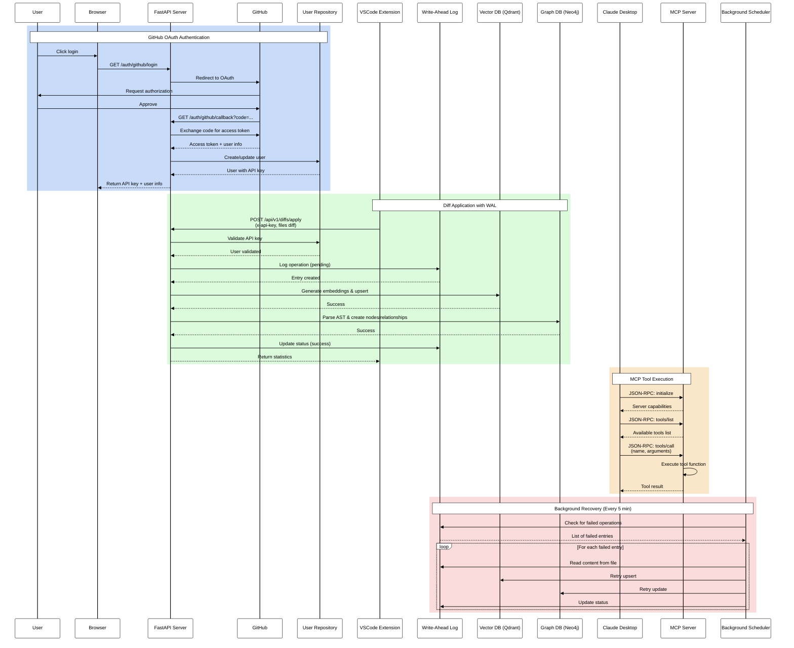

# Clog System Architecture Diagrams

This document contains Mermaid diagrams visualizing the architecture and workflows of the Clog system (TS-LLM-MCP Bridge).

## Sequence Diagram

The following sequence diagram illustrates the main workflows in the system:



### Workflow Descriptions

1. **GitHub OAuth Authentication**: Users authenticate via GitHub OAuth to receive a unique API key. The system creates or updates user records and ensures data isolation per user.

2. **Diff Application with WAL**: VSCode extension sends code changes to the server. All updates are logged to WAL first (Write-Ahead Log), then processed by Vector DB for semantic search and Graph DB for code relationships. Failed operations are automatically retried.

3. **MCP Tool Execution**: Claude Desktop communicates with the MCP Server via JSON-RPC over stdio. Tools include blog posting, Notion publishing, and Git operations.

4. **Background Recovery**: A scheduler runs every 5 minutes to retry failed WAL operations, ensuring data consistency and reliability.

## Class Diagram

The following class diagram shows the main components and their relationships:

```mermaid
%%{init: {'theme':'base', 'themeVariables': { 'primaryColor':'#fff', 'primaryTextColor':'#000', 'primaryBorderColor':'#000', 'lineColor':'#000', 'secondaryColor':'#f0f0f0', 'tertiaryColor':'#fff', 'mainBkg':'#fff', 'secondBkg':'#f0f0f0', 'mainContrastColor':'#000', 'darkMode':'false', 'background':'#fff', 'tertiaryBorderColor':'#000', 'tertiaryTextColor':'#000', 'fontSize':'16px', 'nodeBorder':'#000', 'clusterBkg':'#f0f0f0', 'clusterBorder':'#000', 'titleColor':'#000', 'edgeLabelBackground':'#fff', 'classText':'#000'}}}%%
classDiagram
    %% FastAPI Server Components
    class FastAPIApp {
        +CORSMiddleware
        +lifespan()
        +include_router()
    }

    class AuthRouter {
        +github_login()
        +github_callback()
        +github_logout()
    }

    class DiffsRouter {
        +apply_diffs()
        +validate_api_key()
    }

    class AgentRouter {
        +execute_llm_command()
        +natural_language_processing()
    }

    class CommandsRouter {
        +list_commands()
        +execute_command()
    }

    class HealthRouter {
        +healthz()
        +readyz()
    }

    %% MCP Server Components
    class MCPServer {
        -bool initialized
        +handle_request()
        +initialize()
        +list_tools()
        +call_tool()
        +run()
    }

    class ToolRegistry {
        +TOOLS[]
        +TOOL_EXECUTORS{}
    }

    class PostBlogTool {
        +TOOL
        +run(arguments)
    }

    class PublishNotionTool {
        +TOOL
        +run(arguments)
    }

    class GitCommitTool {
        +TOOL
        +run(arguments)
    }

    class SearchVectorTool {
        +TOOL
        +run(arguments)
    }

    class SearchGraphTool {
        +TOOL
        +run(arguments)
    }

    %% Adapter Components
    class VectorDBAdapter {
        +get_qdrant_client()
        +generate_embedding()
        +upsert_file()
        +delete_file()
        +search()
    }

    class GraphDBAdapter {
        +get_neo4j_driver()
        +parse_python_file()
        +upsert_file()
        +delete_file()
        +search()
    }

    class BlogAPIAdapter {
        +post_article()
        +update_article()
    }

    class NotionAdapter {
        +create_page()
        +update_page()
    }

    class GitHubAdapter {
        +oauth_exchange()
        +get_user_info()
        +create_commit()
    }

    %% Background Components
    class BackgroundScheduler {
        +init_scheduler()
        +start_scheduler()
        +shutdown_scheduler()
        +run_task_now()
    }

    class WAL {
        +log_operation()
        +update_status()
        +get_failed_entries()
        +cleanup_old_entries()
        +get_statistics()
    }

    class Tasks {
        +wal_recovery_task()
        +wal_cleanup_task()
    }

    %% Data Layer
    class User {
        +int id
        +int github_id
        +str username
        +str email
        +str api_key
        +datetime created_at
    }

    class UserRepository {
        +create_user()
        +get_user_by_api_key()
        +get_user_by_github_id()
        +update_user()
    }

    %% Relationships
    FastAPIApp --> AuthRouter
    FastAPIApp --> DiffsRouter
    FastAPIApp --> AgentRouter
    FastAPIApp --> CommandsRouter
    FastAPIApp --> HealthRouter
    FastAPIApp --> BackgroundScheduler

    AuthRouter --> GitHubAdapter
    AuthRouter --> UserRepository

    DiffsRouter --> UserRepository
    DiffsRouter --> WAL
    DiffsRouter --> VectorDBAdapter
    DiffsRouter --> GraphDBAdapter

    AgentRouter --> UserRepository
    AgentRouter --> ToolRegistry

    CommandsRouter --> UserRepository
    CommandsRouter --> ToolRegistry

    MCPServer --> ToolRegistry
    ToolRegistry --> PostBlogTool
    ToolRegistry --> PublishNotionTool
    ToolRegistry --> GitCommitTool
    ToolRegistry --> SearchVectorTool
    ToolRegistry --> SearchGraphTool

    PostBlogTool --> BlogAPIAdapter
    PublishNotionTool --> NotionAdapter
    GitCommitTool --> GitHubAdapter
    SearchVectorTool --> VectorDBAdapter
    SearchGraphTool --> GraphDBAdapter

    BackgroundScheduler --> Tasks
    Tasks --> WAL
    Tasks --> VectorDBAdapter
    Tasks --> GraphDBAdapter

    UserRepository --> User

    VectorDBAdapter ..> User : filters by user_id
    GraphDBAdapter ..> User : filters by user_id
    WAL ..> User : tracks user_id
```

### Component Descriptions

#### FastAPI Server
- **FastAPIApp**: Main application with CORS middleware and router management
- **Routers**: Handle different API endpoints (auth, diffs, agent, commands, health)
- All routers use user authentication and data isolation by `user_id`

#### MCP Server
- **MCPServer**: Stdio-based JSON-RPC 2.0 server for LLM integration
- **ToolRegistry**: Central registry of available tools and their executors
- **Tools**: Individual tool implementations for blog, Notion, Git, Vector DB, and Graph DB operations

#### Adapters
- **VectorDBAdapter**: Qdrant client for semantic search with OpenAI embeddings
- **GraphDBAdapter**: Neo4j client for code relationship tracking with AST parsing
- **BlogAPIAdapter**: Blog posting functionality
- **NotionAdapter**: Notion page creation and updates
- **GitHubAdapter**: GitHub OAuth and Git operations

#### Background Processing
- **BackgroundScheduler**: APScheduler for periodic tasks
- **WAL**: Write-Ahead Log for operation durability and recovery
- **Tasks**: Scheduled tasks for WAL recovery (5 min) and cleanup (1 day)

#### Data Layer
- **User**: User model with GitHub OAuth info and API key
- **UserRepository**: SQLite-based user data access layer
- All data operations are filtered by `user_id` for multi-user isolation

## Architecture Principles

1. **Multi-User Support**: Complete data isolation using `user_id` filtering in all databases
2. **Durability**: WAL ensures all operations are logged before execution
3. **Fault Tolerance**: Background scheduler automatically retries failed operations
4. **Clean Architecture**: Adapter pattern separates external service integrations
5. **Dual Interface**: REST API for clients + MCP for LLM integration

